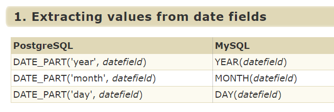
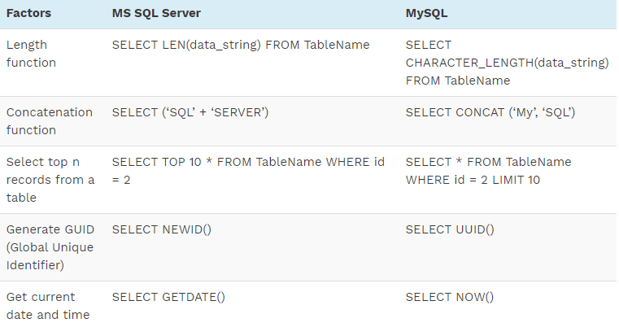
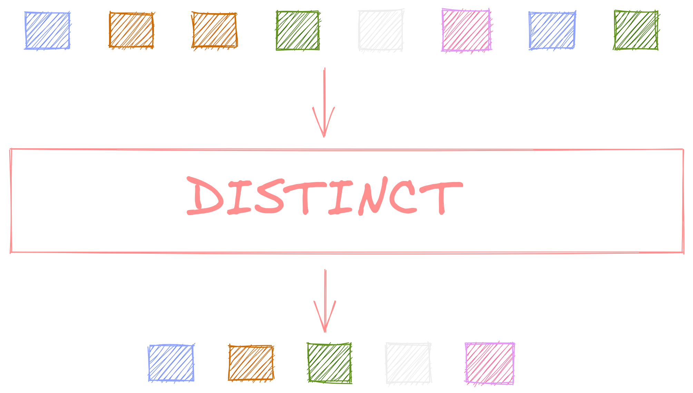
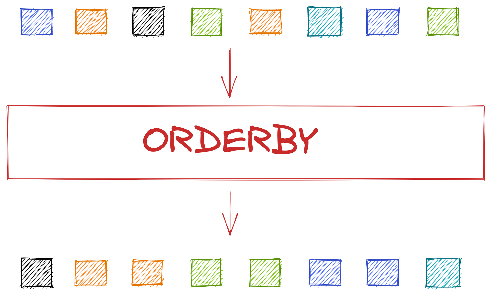

## Encontrando dados

{ width=40% }

---

## Foco de hoje

- QUERY
- DISTINCT
- LIMIT
- OFFSET
- COUNT
- ORDERBY

---

### Qual a ideia de uma query?

---

{ width=60% }

--

### Qual a ideia de uma query?

>R: query é o nome dado em inglês para uma consulta que é feita no banco de dados com o intuito de perguntar para o banco: "Ei, você! Me mostra essa informação aqui, pode ser?".

--

### SQL

- Nós podemos chamar o SQL puro de SQL 'padrão' que é o mais comum e que funciona maioria dos bancos.
- SQL Server, PostgreSQL e Oracle possuem suas 'próprias versões'.

--

### Aula passada

Diferença para outros bancos Relacionais

---

### Pequenas variantes do SQL

{ width=60% }

---

### MYSQL

{ width=60% }

---

### Pequenas variações

{ width=90% }

---

### Pequenas variações

{ width=90% }

---

### Pequenas variações

{ width=80% }

---

### Show me the code

{ width=60% }

---

{ width=100% }

--

### Distinct

```sql
SELECT store_id FROM sakila.customer;
SELECT distinct store_id FROM sakila.customer;
```

--

### Distinct

```sql
SELECT first_name FROM sakila.actor;
SELECT distinct first_name FROM sakila.actor;
```

--

### Distinct

```sql
SELECT last_name FROM sakila.actor;
SELECT distinct first_name FROM sakila.actor;
```

--

### Distinct


```sql
# O que acontece aqui?

SELECT distinct first_name, last_name FROM sakila.actor;
```

--

### Distinct

> R: O sistema de banco de dados monta uma lista de todos os resultados (incluindo duplicados), ele ordena os resultados de acordo com o que você tiver especificado, remove os resultados duplicados e depois exibe o resultado a você.

---

### LIMIT

{ width=100% }

--

### LIMIT & OFFSET

```sql
SELECT * FROM country LIMIT 5;
```

--


### OFFSET

{ width=100% }

--

### Me ajudem

> Usando essa mesma tabela, como seria possível exibir meus resultados a partir da Áustria, considerando que os country_id estão ordenados em ordem crescente?

--

```sql
SELECT * FROM country
    ORDER BY country_id
    LIMIT 10 OFFSET 8;
```

--

### Complementando

> O offset é usado para pular uma quantidade de resultados e entregar ou exibir apenas os resultados após o pulo (em linhas) que foi feito.

---

### Onde podemos usar esses conceitos?

https://www.magazineluiza.com.br/notebook-e-macbook/informatica/s/in/ntmk/

---

### COUNT

{ width=70% }

--

### Nao conta nulls

{ width=40% }

--

> O count pode ser utilizado para contar a quantidade de registros que uma query retorna. É importante lembrar que o COUNT não contabiliza valores nulos.

--

### Trazendo para o dia a dia ...

- Sites de vendas poderiam usar o count para saber o total de produtos disponíveis;
- Google mostra a quantidade de resultados de uma pesquisa;
- Quantidade de emails na caixa de entrada.

--

### Exemplos

```sql
SELECT COUNT(*) FROM sakila.address;

SELECT COUNT(address) FROM sakila.address;
```

--

### Pergunta

> Como seria possível montar uma query para descobrir a quantidade de cidades únicas cadastradas na tabela address?

--

### Resposta

```sql
SELECT COUNT(DISTINCT city_id)
FROM sakila.address;
```

--

### Pergunta

> como seria possível encontrar a quantidade de cidades e quantidade de distritos cadastrados?

--

### Resposta

```sql
SELECT COUNT(city_id), COUNT(district)
FROM sakila.address;
```

--

### Alias

> Aproveitando a última consulta, como poderiamos dar um nome para o resultado?

--

### Resposta

```sql
SELECT COUNT(city_id) as `city_count`, COUNT(district) as `district_count`
FROM sakila.address;
```

---

{ width=90% }

--

### ORDER BY

> Em resumo: retorna todos os dados encontrados e ordena por uma ou mais colunas.

--

### ORDER BY

```sql
SELECT * FROM sakila.actor
ORDER BY first_name;

SELECT * FROM sakila.customer
ORDER BY customer_id;
```

--

### Invertendo a ordem?

```sql
ASC || DESC ?
```

--

### Invertendo a ordem?

```sql
SELECT * FROM sakila.customer
ORDER BY customer_id ASC;

SELECT * FROM sakila.customer
ORDER BY customer_id DESC;
```

---

### Bora práticar?

- Chat

--

### Dúvidas?

{ width=90% }